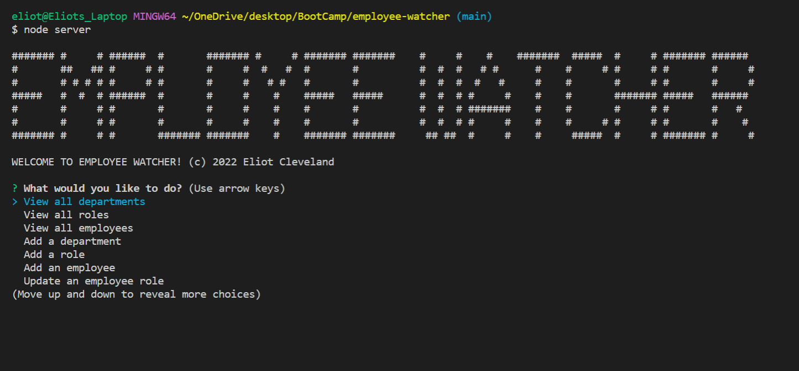

# Employee-watcher

**This is a command line based program that utilzes Node, Express, Inquirer & Axios to deliver an employee managment system. The user is able to interact with the database in multiple ways such as viewing each table, and adding and updating employee, role and department records. Creating this application solidified my understanding of the back end. There are still a few improvements that would make it more user friendly, such as dynamically creating inquirer prompts to update with employee roles, departments, manager roles, etc. We'll call it a work in progress!**

## Table of Contents

[Installation Instructions](#installation-instructions)

[Usage Information](#usage-information)

[Contribution Guidelines](#contribution-guidelines)

[Collaboration Credits](#collaboration-credits)

[Questions](#questions)

[License](#license)

## Installation Instructions

Node and Mysql must be installed for this program to run. Clone repository and run [npm install]. The database will need to be created in the mysql shell first before the program will function. Run the sql scripts to set up and seed the database. After setting up, the app should run by typing [node server] into the terminal. 
## Usage Information

Follow the command line prompts to interact with the meployee database.
## Contribution Guidelines

Anyone is welcome to contribute by creating an issue or featur branch. Please reach out as this repo is not closely monitored.
## Collaboration Credits

This is a homework assignment for a full stack Boot Camp. While the app was built from the ground up, ideas and functionality were borrowed from the week's lesson.
## Questions
For information about the developer, see my [GitHub Profile](https://github.com/eclevela-1234)

For general questions, please email me: eliothead@live.com
## License
Copyright (c)  2022 by [eclevela-1234](https://github.com/eclevela-1234)

MIT License

Permission is hereby granted, free of charge, to any person obtaining a copy
of this software and associated documentation files (the "Software"), to deal
in the Software without restriction, including without limitation the rights
to use, copy, modify, merge, publish, distribute, sublicense, and/or sell
copies of the Software, and to permit persons to whom the Software is
furnished to do so, subject to the following conditions:

The above copyright notice and this permission notice shall be included in all
copies or substantial portions of the Software.

THE SOFTWARE IS PROVIDED "AS IS", WITHOUT WARRANTY OF ANY KIND, EXPRESS OR
IMPLIED, INCLUDING BUT NOT LIMITED TO THE WARRANTIES OF MERCHANTABILITY,
FITNESS FOR A PARTICULAR PURPOSE AND NONINFRINGEMENT. IN NO EVENT SHALL THE
AUTHORS OR COPYRIGHT HOLDERS BE LIABLE FOR ANY CLAIM, DAMAGES OR OTHER
LIABILITY, WHETHER IN AN ACTION OF CONTRACT, TORT OR OTHERWISE, ARISING FROM,
OUT OF OR IN CONNECTION WITH THE SOFTWARE OR THE USE OR OTHER DEALINGS IN THE
SOFTWARE.

For more information visit https://opensource.org/licenses/MIT

